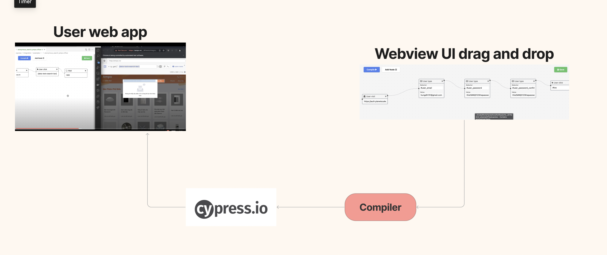

<p align="center">
  <a href="#">
    <h1 align="center">CTFLOW</h1>
  </a>
</p>

<p align="center">
  <a aria-label="CodeClimate Maintainability" href="https://codeclimate.com/github/TestHaters/ctflow/maintainability">
    
  </a>
  <a aria-label="CodeClimate Test Coverage" href="https://codeclimate.com/github/TestHaters/ctflow/test_coverage">
    
  </a>
</p>


<br/><br/><br/><br/>


# User guide
- Please install [vscode](https://code.visualstudio.com/docs/setup/setup-overview) or sign up and use a [codespace](https://github.com/features/codespaces) account
- Install [Codeless Testing Flow](https://marketplace.visualstudio.com/items?itemName=ctflow.ctflow) extension for your local vscode or codespace
- Install [Cypress](https://docs.cypress.io/guides/getting-started/installing-cypress) because we use **cypress** testing engine
- Run command `yarn cypress open` (or `npm` if you're using npm) to have `cypress` folder at your project
- Add a `.ctflow` file in `cypress/e2e` folder
- Select the `.ctflow` file to see the drag and drop UI


# Architecture
This is the architecture 

The **Webview UI** is built by **React** and **Vite** as an UI component for VSCode extension. All testers interaction on the Webview UI will be recorded and translated into **cypress** test cases(`javascript` code) by our **compiler**. The test cases then are run by **cypress** on top of the user's app.


# Tech stack (Vscode + React + Vite)

The project ultilize fast bundling speed of [Vite](https://vitejs.dev/) and familiarity of [React](https://reactjs.org/) to quickly bring about the intuitive UI for the user. 

## Documentation

For a deeper dive into project and its foundation example, read the guides below.

- [Extension structure](./dnd-ui/docs/extension-structure.md)
- [Extension commands](./dnd-ui/docs/extension-commands.md)
- [Extension development cycle](./dnd-ui/docs/extension-development-cycle.md)

## Run The Code

```bash
# Navigate into sample directory
cd dnd-ui

# Install dependencies for both the extension and webview UI source code
npm run install:all

# Build webview UI source code
npm run build:webview

# Open sample in VS Code
code .
```

Once the sample is open inside VS Code you can run the extension by doing the following:

1. Press `F5` to open a new Extension Development Host window
2. Inside the host window, open the command palette (`Ctrl+Shift+P` or `Cmd+Shift+P` on Mac) and select `.ctflow` files to see the UI


## Backed & Supported by
<div>
<a href="https://coderpush.com">  </a>
<a href="https://reactflow.dev">  </a>
</div>
