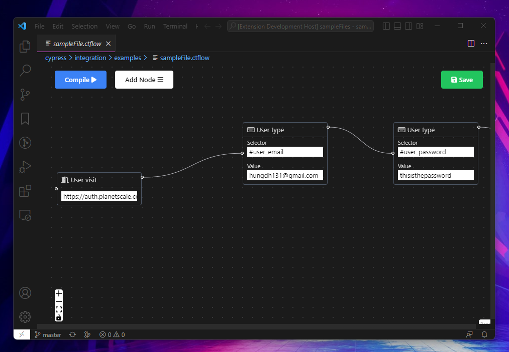

# Architecture
The **Webview UI** is built by **React** and **Vite** as an UI component for VSCode extension. All testers interaction on the Webview UI will be recorded and translated into **cypress** test cases(`javascript` code) by our **compiler**. The test cases then are run by **cypress** on top of the user's app.


# Tech stack (Vscode + React + Vite)

The project ultilize fast bundling speed of [Vite](https://vitejs.dev/) and familiarity of [React](https://reactjs.org/) to quickly bring about the intuitive UI for the user. 



## Documentation

For a deeper dive into project and its foundation example, read the guides below.

- [Extension structure](./docs/extension-structure.md)
- [Extension commands](./docs/extension-commands.md)
- [Extension development cycle](./docs/extension-development-cycle.md)

## Run The Code

```bash
# Navigate into sample directory
cd dnd-ui

# Install dependencies for both the extension and webview UI source code
npm run install:all

# Build webview UI source code
npm run build:webview

# Open sample in VS Code
code .
```

Once the sample is open inside VS Code you can run the extension by doing the following:

1. Press `F5` to open a new Extension Development Host window
2. Inside the host window, open the command palette (`Ctrl+Shift+P` or `Cmd+Shift+P` on Mac) and select `.ctflow` files to see the UI