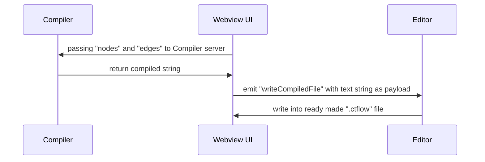

```mermaid
sequenceDiagram
    participant C as Compiler
    participant WV as Webview UI
    participant E as Editor
        WV ->> C: passing "nodes" and "edges" to Compiler server
        C ->> WV: return compiled string
        WV ->> E: emit "writeCompiledFile" with text string as payload
        E ->> WV: write into ready made ".ctflow" file

```
