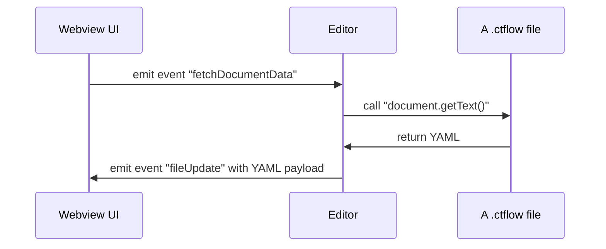

```mermaid
sequenceDiagram
    participant WV as Webview UI
    participant E as Editor
    participant F as A .ctflow file
        WV ->> E: emit event "fetchDocumentData"
        E ->> F: call "document.getText()"
        F ->> E: return YAML
        E ->> WV: emit event "fileUpdate" with YAML payload

```
